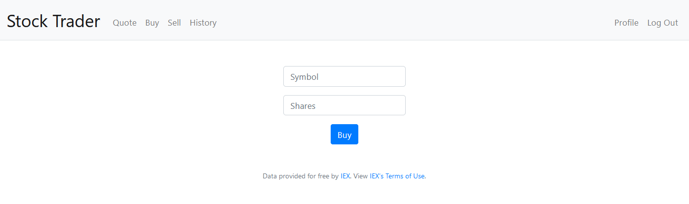

# Stock Trader

Stock Trader is a simulated stock trading Flask application that allows users to buy and sell stocks based on their current market values, using data provided by IEX. This app was initially developed as part of Harvard's CS50 programming course.

## Dependencies

- <a href="https://flask.palletsprojects.com/en/2.0.x/installation/">Flask</a>
- <a href="https://flask-session.readthedocs.io/en/latest/"> Flask-Session</a>
- <a href="https://werkzeug.palletsprojects.com/en/2.0.x/">Werkzeug</a>
- <a href="https://cs50.readthedocs.io/libraries/cs50/python/">CS50</a>
- <a href="https://www.sqlite.org/index.html">SQLite</a>

## Getting Started
Clone the project from Github:
 
`git clone https://github.com/cameronalberg/stock_trader`

Install all required libraries individually, or by using <a href="https://pip.pypa.io/en/stable/quickstart/">pip</a>:
 
`pip install -r requirements.txt`

Stock Trader gets real time market data from <a href="https://iexcloud.io">IEX</a>. In order to use this data, you will need to create an account to generate your own API token. To do so:

- Visit iexcloud.io/cloud-login#/register/.
- Enter your email address and a password, and click “Create account”.
- On the next page, scroll down to choose the Start (free) plan.
- Once you’ve confirmed your account via a confirmation email, sign in to iexcloud.io.
- Click API Tokens.
- Copy the key that appears under the Token column (it should begin with `pk_`).

Your unique API key will need to be set as an environment variable before running the application,  by setting `API_KEY="your_key"`
